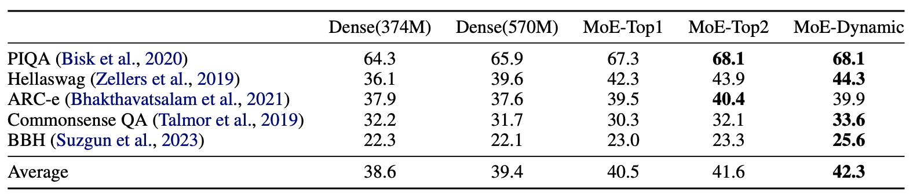
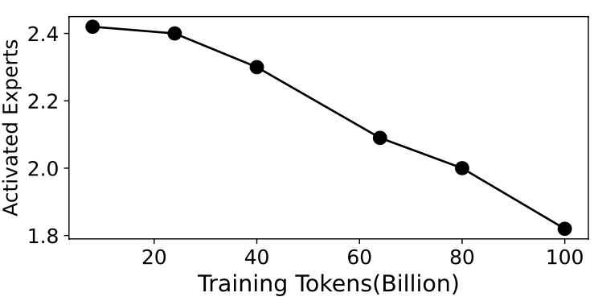
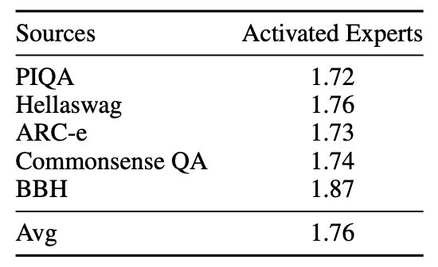

# Dynamic-MoE

## 1 Introduction

Dynamic MoE introduces a novel dynamic expert selection framework for Mixture of Experts (MoE) models, aiming to enhance computational efficiency and model performance by adjusting the number of activated experts based on input difficulty. Unlike existing MoE approaches that rely on fixed TopK Routing, which activates a predetermined number of experts regardless of the input's complexity, this method dynamically allocates experts based on the confidence level in expert selection for each input. This allows for more efficient utilization of computational resources, activating more experts for complex tasks requiring advanced reasoning and fewer for simpler tasks. 


## 2 Evaluation Results

Dynamic routing method demonstrates substantial improvements over Top2 Routing across various benchmarks, achieving an average improvement of 0.7% with less than 90% activated parameters.




## 3 Efficiency of Dynamic MoE

### Efficient Training

We can observe that the number of experts activated per token decreases over time. In the early stages of training, dynamic routing assigns more experts to each token, but after 60B tokens, the average number of activated experts is already less than 2. 




### Efficient Inference

Across all five downstream tasks, the number of activated experts is less than two. The model activates 1.76 experts on average, which is fewer than the fixed activation of two experts by the Top2 Routing method.




## 4 Quick Start

### Model Weights

Model weights can be get [here](https://huggingface.co/AnLan577/Dynamic_MoE)


### Text Generation

```python
from transformers import AutoTokenizer
import torch
from modeling.modeling_moe import MoEForCausalLM
from modeling.configuration_moe import MoEConfig


def generate(tokenizer, model, text):
    inputs = [text]
    tokens = tokenizer(inputs,return_tensors="pt")
    input_ids = tokens.input_ids.cuda()
    generate_ids = model.generate(inputs=input_ids,
                num_beams=1, 
                bos_token_id=tokenizer.bos_token_id,
                eos_token_id=tokenizer.eos_token_id,
                pad_token_id=tokenizer.pad_token_id,
                max_new_tokens=256,top_p=0.9, temperature=1.0, do_sample=True)
    outputs = tokenizer.batch_decode(generate_ids, skip_special_tokens=True, clean_up_tokenization_spaces=False)
    response = [outputs[i][len(inputs[i]):] for i in range(len(outputs))][0]
    return response    
    
    

if __name__ == "__main__":
    model_path = 'path_to_dynamicmoe_moedel'
    tokenizer = AutoTokenizer.from_pretrained(model_path)
    tokenizer.pad_token = tokenizer.unk_token

    model_config = MoEConfig.from_pretrained(model_path,trust_remote_code=True)
    model = MoEForCausalLM.from_pretrained(
        model_path,
        from_tf=False,
        config=model_config,
        torch_dtype=torch.bfloat16,
        low_cpu_mem_usage=True
    ).cuda()    
    model.eval() 

    response = generate(tokenizer, model, 'The highest mountain in the world is')
    print(response)
    

```


## 5 Citation

```
@article{huang2024harder,
  title={Harder Tasks Need More Experts: Dynamic Routing in MoE Models},
  author={Huang, Quzhe and An, Zhenwei and Zhuang, Nan and Tao, Mingxu and Zhang, Chen and Jin, Yang and Xu, Kun and Chen, Liwei and Huang, Songfang and Feng, Yansong},
  journal={arXiv preprint arXiv:2403.07652},
  year={2024}
}
```

